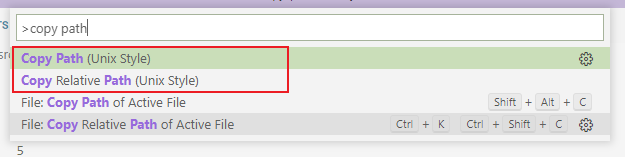
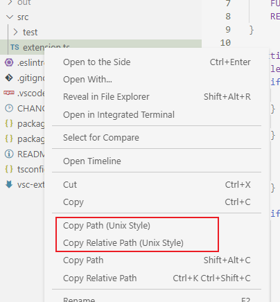

# Copy Path (Unix Style)

Copy Windows paths to clipboard in Unix/Linux/POSIX style.  Can be used to copy paths for use in Git Bash, WSL, Cygwin, or in Windows format using forward-slashes ('/')

## Features

By default, the extension adds the following commands to copy the active file path and file relative paths in Unix style

- Copy Path (Unix Style): `/c/chris/project-name/src/extension.ts`
- Copy Relative Path (Unix Style): `src/extension.ts`

### Command Palette

### Editor Title Context Menu

### Explorer Context Menu

## Customization

### Default Format

The format used by default can be modified via the `copy-path-unixstyle.defaultFormat` setting:

| Format              | Example                                           | Default |
|---------------------|---------------------------------------------------|---------|
| GitBash             | `/c/chris/project-name/src/extension.ts`          | ✔️       |
| WSL                 | `/mnt/c/chris/project-name/src/extension.ts`      |         |
| Cygwin              | `/cygdrive/c/chris/project-name/src/extension.ts` |         |
| WindowsForwardSlash | `C:/chris/project-name/src/extension.ts`          |         |

### Additional Commands

If you want to be able to copy paths in multiple formats, you can enable additional commands with the following settings:

| Setting                                                        | Enables Command                                 | Default |
|----------------------------------------------------------------|-------------------------------------------------|---------|
| `copy-path-unixstyle.copyPath.enable`                          | Copy Path (Unix Style)                          | true    |
| `copy-path-unixstyle.copyPathGitBashFormat.enable`             | Copy Path (Unix Style - Git Bash format)        | false   |
| `copy-path-unixstyle.copyPathWSLFormat.enable`                 | Copy Path (Unix Style - WSL format)             | false   |
| `copy-path-unixstyle.copyPathCygwinFormat.enable`              | Copy Path (Unix Style - Cygwin format)          | false   |
| `copy-path-unixstyle.copyPathWindowsForwardSlashFormat.enable` | Copy Path (Unix Style - Windows format using /) | false   |

## Acknowledgements

This extension was inspired by the following extensions.  I am extremely grateful to have these extensions as a reference and inspiration.  Thank you.

- https://github.com/bpasero/copy-path-relative-posix (rssowl.copy-relative-path-posix)
- https://github.com/sailhenz/copy-path-linux (sailhenz.copy-path-linux)
