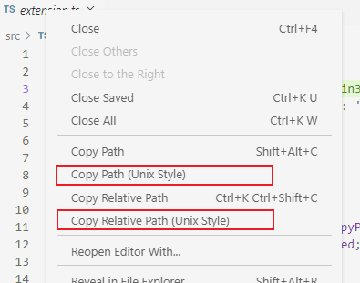

# Copy Path (Unix Style)

Copy Windows paths to clipboard in Unix/Linux/POSIX style

## Features

Adds commands to copy the active file path and file relative paths in Unix style

- Copy Path (Unix Style): `/c/chris/project-name/src/extension.ts`
- Copy Relative Path (Unix Style): `src/extension.ts`

### Command Palette

### Editor Title Context Menu

### Explorer Context Menu

)

## Requirements

This has been tested in vscode 1.50.1.  It may work in earlier versions as well, but YMMV.

## Acknowledgements

This extension was inspired by the following extensions.  I am extremely grateful to have these extensions as a reference and inspiration.  Thank you.

- https://github.com/bpasero/copy-path-relative-posix (rssowl.copy-relative-path-posix)
- https://github.com/sailhenz/copy-path-linux (sailhenz.copy-path-linux)
